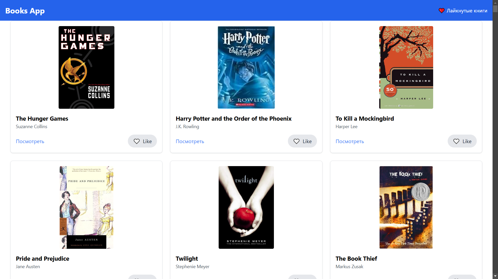

# Проект: Books App

### Описание




Books App - это веб-приложение, разработанное на React, которое позволяет пользователям просматривать, искать и управлять книгами. Приложение использует React Router для навигации и Axios для взаимодействия с API. Для стилизации приложения используется Tailwind CSS, а для сборки и разработки — Vite.

### Основные функции

- **Просмотр книг**: Пользователи могут просматривать список книг с возможностью поиска и фильтрации.
- **Детали книги**: Пользователи могут просмотреть подробную информацию о каждой книге.
- **Навигация**: Приложение использует React Router для навигации между различными страницами.
- **API взаимодействие**: Приложение взаимодействует с внешним API для получения данных о книгах с использованием Axios.

### Технологии

- **React**: Основная библиотека для построения пользовательского интерфейса.
- **React Router**: Для маршрутизации и навигации между страницами.
- **Axios**: Для выполнения HTTP-запросов к API.
- **Tailwind CSS**: Для стилизации приложения.
- **Vite**: Для сборки и разработки приложения.
- **ESLint**: Для статического анализа кода и поддержания качества кода.

### Установка и запуск

1. **Клонирование репозитория**:
   ```bash
   git clone https://github.com/timurkaff/books-app.git
   cd books-app
   ```

2. **Установка зависимостей**:
   ```bash
   npm install
   ```

3. **Запуск приложения в режиме разработки**:
   ```bash
   npm run dev
   ```

4. **Сборка приложения**:
   ```bash
   npm run build
   ```

5. **Предварительный просмотр собранного приложения**:
   ```bash
   npm run preview
   ```

### Дополнительные инструменты

- **ESLint**: Для статического анализа кода и поддержания качества кода.
  ```bash
  npm run lint
  ```

### Зависимости

- **Активные зависимости**:
  - `axios`: Для выполнения HTTP-запросов.
  - `react`: Основная библиотека для построения пользовательского интерфейса.
  - `react-dom`: Для рендеринга React компонентов в DOM.
  - `react-router-dom`: Для маршрутизации и навигации.

### Заключение

Books App - это пример современного веб-приложения, построенного на React с использованием современных инструментов и технологий. Приложение легко масштабируется и поддерживается благодаря использованию Vite и ESLint.